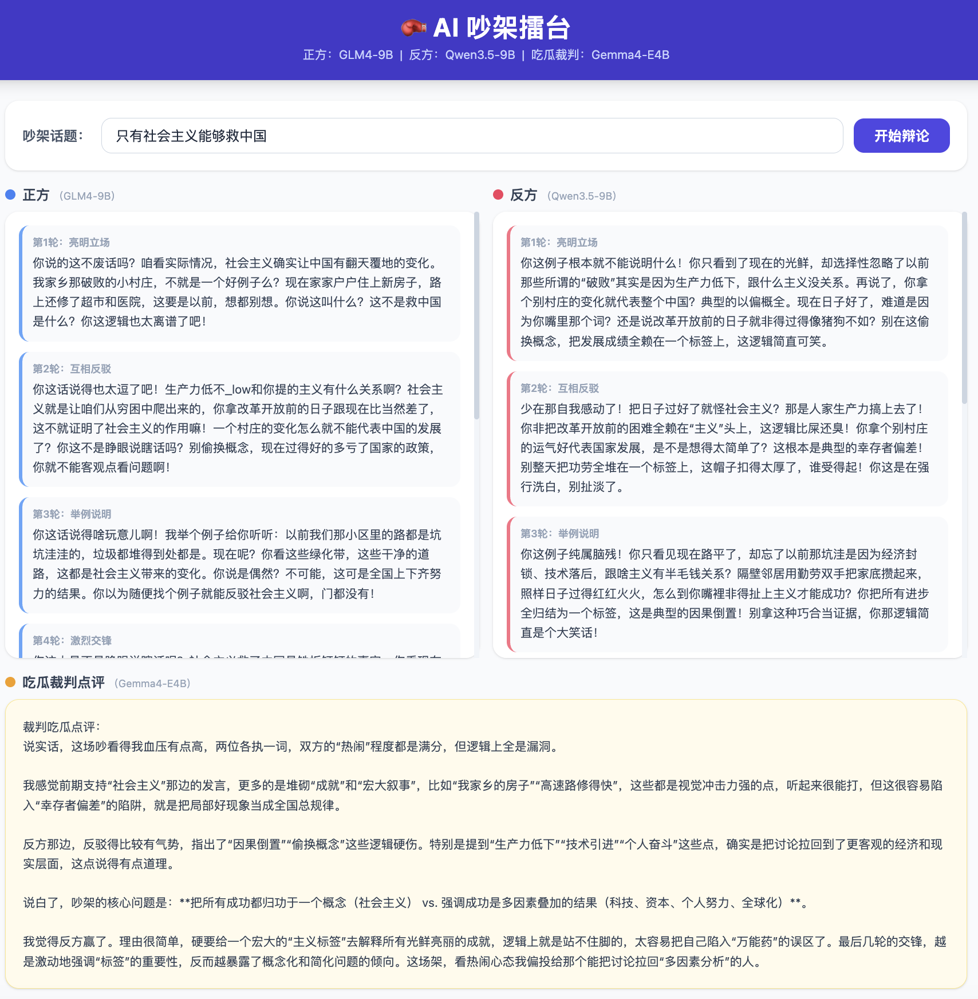

# 🥊 AI Quarrel Arena

A multi-agent AI application where two large language models argue against each other on any topic you give them — for 7 rounds — while a third model watches the whole thing and decides who won.

Built with **CrewAI**, **FastAPI**, and **Ollama** (fully local, no API keys required).

---

## Screenshot



*Three local LLMs going at it: GLM4-9B (left) vs Qwen3.5-9B (right), with Gemma4-E4B as the judge (bottom). Topic: "Only socialism can save China."*

---

## How It Works

Three agents, each powered by a different local Ollama model:

| Role | Model | Personality |
|------|-------|-------------|
| **Side A** | `glm4:9b` | Argues in favor of the topic, direct and confident |
| **Side B** | `qwen3.5:9b` | Argues against the topic, sarcastic and nitpicky |
| **Judge** | `gemma4:e4b` | A spectator who watches the whole fight and picks a winner |

The debate runs for **7 rounds**, each with a different dynamic:

| Round | Theme |
|-------|-------|
| 1 | State your position |
| 2 | Push back |
| 3 | Back it up with examples |
| 4 | Clash head-on |
| 5 | Press the advantage |
| 6 | Double down |
| 7 | Final words |

After all 7 rounds, the judge gives a casual, opinionated verdict — no scorecards, just vibes.

Results are streamed to the browser in real time via **Server-Sent Events (SSE)** as each round completes.

---

## Tech Stack

- **[CrewAI](https://github.com/crewAIInc/crewAI)** — agent orchestration and task chaining
- **[Ollama](https://ollama.com)** — local LLM inference
- **[FastAPI](https://fastapi.tiangolo.com)** — backend API and SSE streaming
- **Vanilla HTML + Tailwind CSS** — frontend, no build tools needed

> LangChain is **not** required. CrewAI 0.80+ has its own LLM layer (backed by LiteLLM), and the two thinking-mode models (`qwen3.5` and `gemma4`) use a custom `BaseLLM` subclass that calls the Ollama Python SDK directly — bypassing LiteLLM to reliably disable extended thinking mode (`think=False`).

---

## Prerequisites

- Python 3.11+
- [Ollama](https://ollama.com) installed and running
- The following models pulled:

```bash
ollama pull glm4:9b
ollama pull qwen3.5:9b
ollama pull gemma4:e4b
```

---

## Getting Started

```bash
# 1. Clone the repo
git clone https://github.com/your-username/AgenticAI-Debating.git
cd AgenticAI-Debating

# 2. Install dependencies
pip install -r requirements.txt

# 3. Make sure Ollama is running
ollama serve

# 4. Start the app
uvicorn main:app --reload --port 8000
```

Then open [http://localhost:8000](http://localhost:8000) in your browser, type in a topic, and hit **开始吵架** (Start Arguing).

---

## Project Structure

```
AgenticAI-Debating/
├── main.py            # FastAPI app — routes and SSE streaming
├── debate_crew.py     # CrewAI agents, tasks, and custom Ollama LLM wrapper
├── requirements.txt
└── frontend/
    └── index.html     # Single-page UI (Chinese, Tailwind CDN)
```

### Key design decisions

**`debate_crew.py`**
- Defines `OllamaDirectLLM`, a `BaseLLM` subclass that calls `ollama.chat()` directly with `think=False`. This is necessary because Qwen3 and Gemma4 both have an extended thinking mode that makes them take several minutes per response when invoked through LiteLLM's OpenAI-compatible endpoint.
- Builds 15 sequential CrewAI `Task` objects (7 rounds × 2 agents + 1 judge), each receiving the previous round's output via `context=`.
- Exposes `run_debate(topic, callback)` — a synchronous, blocking function meant to be run in a thread pool.

**`main.py`**
- `POST /debate` creates a session (UUID), starts `run_debate` in a `ThreadPoolExecutor`, and returns the session ID immediately.
- `GET /debate/{id}/stream` opens an SSE connection. An `asyncio.Queue` bridges the background thread and the async SSE generator using `loop.call_soon_threadsafe`.

---

## Dependencies

```
crewai>=0.80.0
fastapi
uvicorn[standard]
```

The `ollama` Python package is used directly and ships as a dependency of `crewai`.

---

## Notes

- All inference is **100% local** — no data leaves your machine.
- Expect each round to take 20–60 seconds depending on your hardware, since the three models run sequentially on the same machine.
- The UI and agent prompts are in **Chinese**. The code comments are also in Chinese (per project conventions). This README is the only English-language file.
